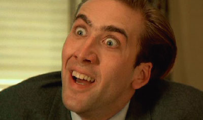

Alfred-Cage-Workflow
===

> Get the sizable, dynamic Image of Nicolas Cage using [PlaceCage](https://www.placecage.com/)  
> It is useful for prototyping. Of course, you can use when you want to get the energy from him.

Installation
===
You can download from here.

[Download](https://github.com/moschan/alfred-cage-workflow/archive/v1.0.zip)

Usage
===

Single param
---

Multiple params
---
You can pass multiple params. First param is width. Second param is Height.

Open in Browser
---
You can open in browser directly. When you tap enter button, you hold ⌘(Comand) Button.

Contribution
---
Of course! Welcome :)

Credits
===
- [http://www.placecage.com/](http://www.placecage.com/)
- [@davecowart](https://twitter.com/davecowart)

## Support on Beerpay
Hey dude! Help me out for a couple of :beers:!

  